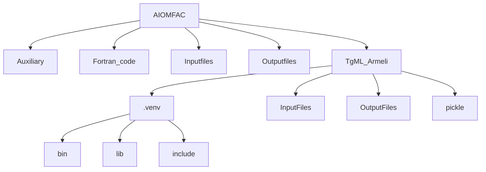

# AIOMFAC-web, Public Model Code Repository
This public repository provides the AIOMFAC model Fortran code (AIOMFAC-web, version 2.20 and newer) and additional information about building and running the model on your own system. May it be of use to you.

## About AIOMFAC
AIOMFAC stands for Aerosol Inorganic&ndash;Organic Mixtures Functional groups Activity Coefficients, it is a thermodynamic group-contribution model to describe non-ideal mixing in liquid solutions. If you are unfamiliar with the purpose and applications of AIOMFAC, please visit the AIOMFAC website https://aiomfac.lab.mcgill.ca for more information.

----
> [!TIP]
> Click on the  icon at the top right of this readme file to show the *table of contents* of this file with links to specific sections.

## AIOMFAC-web model versions and related code and feature updates
Information associated with specific model versions, including comments on major AIOMFAC-web changes and new features, are provided on the page accompanying that release; see under [releases](https://github.com/andizuend/AIOMFAC/releases). 

## Applications, Modifications and Citation
If you use any of our AIOMFAC code in your own projects / code, following the GNU license restrictions, we would appreciate hearing about it. In scientific or other publications, we also request that you reference the main peer-reviewed publications which describe the theoretical underpinning of the AIOMFAC model and its parameterizations, as described in more detail on the AIOMFAC website: https://aiomfac.lab.mcgill.ca/citation.html.

### License
All files presented here are covered under the GNU GPL license v3.0. For more information, please read the license file. A brief overview of the viable permissions can be found here: http://choosealicense.com/licenses/.

## Dependencies
- Starting with AIOMFAC-web v3.14, which supports pure-component viscosity predictions via a machine learning method implemented in Python, there are several specific Python packages that will need to be installed in a dedicated virtual environment (see installation instructions below).
- The Fortran code is dependency-free, except for requiring a compiler supporting the Fortran 2008 standard (or newer). For example, gfortran v9 and newer or the Intel oneAPI ifx compiler.

## Installation instructions
> [!NOTE] 
> The following steps are first outlined for a Windows 64-bit installation (denoted by steps tagged as [Windows]). Equivalent steps are also shown for installation on a Linux machine (denoted by tag [Linux]). The Linux steps were tested with RHEL v8.1; the details for other Linux distributions may differ slightly.

### (1) Relative folder structure
Copy/source the AIOMFAC folders and contained files from this repository to your local project.
On Linux, the main folder structure should look as illustrated below (not showing all subfolders of the .venv directory). On Windows the structure is the same but the folders inside .venv differ. The .venv content will get generated automatically; see step (2) below.

-To be added...

----
## Quick guide to running AIOMFAC from a command prompt
If all you wish to do is to run the AIOMFAC program for your own system of components, this is a relatively straightforward task. The following inputs need to be provided.

-To be added...
